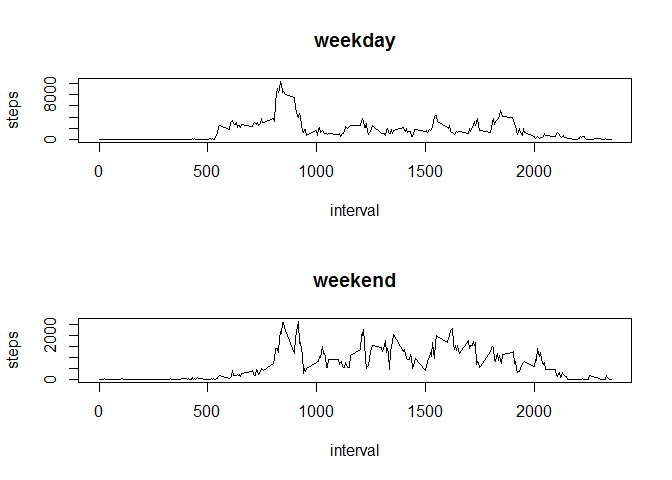

# Reproducible Research: Peer Assessment 1


## Loading and preprocessing the data

```r
stepsData <- read.csv("C:/Users/Michael/Documents/dataScience/activity.csv")
stepsData$date <- as.Date(stepsData$date, format="%Y-%m-%d")
```

## What is mean total number of steps taken per day?

```r
totalSteps <- tapply(stepsData$steps, stepsData$date, sum)

hist(totalSteps)
```

<!-- -->

```r
mean(totalSteps, na.rm = TRUE)
```

```
## [1] 10766.19
```

```r
median(totalSteps, na.rm = TRUE)
```

```
## [1] 10765
```

## What is the average daily activity pattern?
Plot of the average number of steps for each time interval and interval with the maximum number of avg. steps.

```r
avgStepsByInterval <- aggregate(steps ~ interval, data=stepsData, FUN=mean)
with(avgStepsByInterval, plot(interval, steps, type="l"))
```

<!-- -->

```r
avgStepsByInterval[which.max(avgStepsByInterval$steps), "interval"]
```

```
## [1] 835
```


## Imputing missing values
Number of missing values & histogram of steps when NA values are replaced with the interval mean:

```r
sum(is.na(stepsData$steps))
```

```
## [1] 2304
```

```r
stepsDataModified <- stepsData
stepsDataModified$steps <- as.numeric(stepsDataModified$steps)
naRows <- which(is.na(stepsDataModified$steps), arr.ind = TRUE)
stepsDataModified$steps[naRows] <- avgStepsByInterval[match(stepsDataModified$interval[naRows], avgStepsByInterval$interval), "steps"]
totalStepsModified <- tapply(stepsDataModified$steps, stepsDataModified$date, sum)

hist(totalStepsModified, xlab="steps")
```

<!-- -->

```r
mean(totalStepsModified)
```

```
## [1] 10766.19
```

```r
median(totalStepsModified)
```

```
## [1] 10766.19
```

## Are there differences in activity patterns between weekdays and weekends?
Weekdays have a higer maximum number of steps when compared to weekends:

```r
weekends <- c("Saturday", "Sunday")
stepsDataModified$weekday <- factor((weekdays(stepsDataModified$date) %in% weekends), levels=c(TRUE,FALSE), labels=c("weekend", "weekday"))

weekdayData <- subset(stepsDataModified, weekday=="weekday")
totalWeekday <- aggregate(steps ~ interval, data=weekdayData, FUN=sum)

weekendData <- subset(stepsDataModified, weekday=="weekend")
totalWeekend <- aggregate(steps ~ interval, data=weekendData, FUN=sum)

par(mfrow=c(2,1))
with(totalWeekday, plot(interval, steps, type="l", main ="weekday"))
with(totalWeekend, plot(interval, steps, type="l", main="weekend"))
```

<!-- -->
